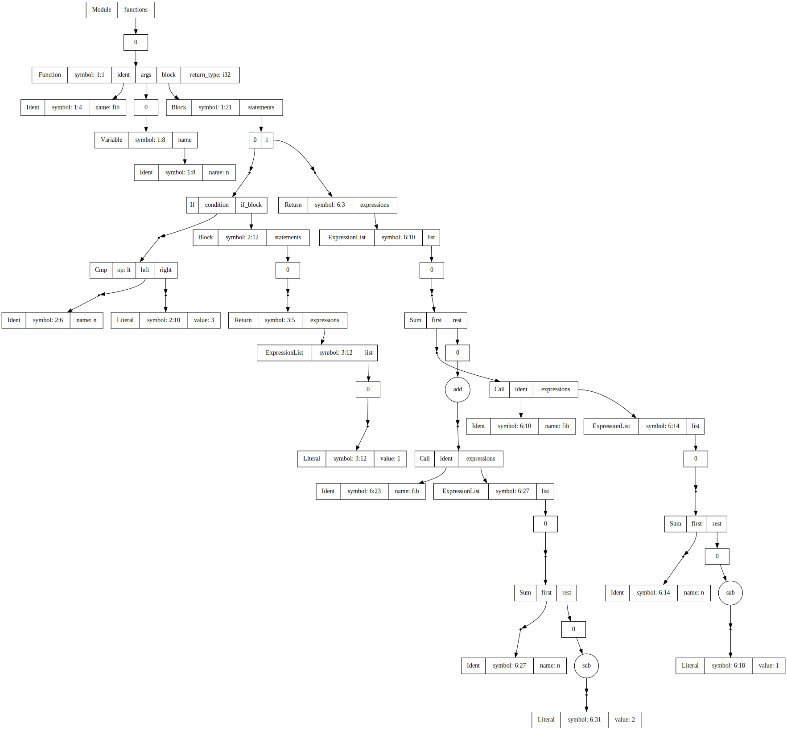

# RJ - work in progress programming language

Are you too smart for [golang](https://go.dev/), but too dumb for [rust](https://www.rust-lang.org/)?

Fear not, you are not alone!

RJ to the rescue - *The brand new hipster language no one asked for*
## Pipeline

### AST (projects/rjc_ast)

The AST is written as an acyclic graph. You can view any AST by running:
```sh
cargo run -- <FILE> --emit-ast
```
However, due to the memory structure making heavy use of `PoolRef`s (referenced by indexes in the AST pool)
it is very hard to reason about.

To output a graph in dot language you can run:
```sh
cargo run -- <FILE> --emit-ast-graph
```

Here is an example on the following code:
```
fn fib(n: i32): i32 {
  if n < 3 {
    return 1
  }

  return fib(n - 1) + fib(n - 2)
}
```

`cargo run -- test.rj --emit-ast-graph | dot -Tsvg > images/fib-ast.svg`:



### Parser (projects/rjc_parser)

Takes in a file and parses it into an AST.

### Resolver (projects/rjc_resolver)

**Not implemented** Walks through the AST and resolves the identifiers and imports.

### Typer (src/typer)

**Not implemented** Resolves and checks types.

### RJ IR Generator (projects/ir_gen)

**Not implemented** Translates the AST into RJ IR.

### Optimiser (projects/optimiser)

**Not implemented** Performs language specific optimisations on the RJ IR.

### LLVM Generator (projects/llvm_gen)

**Not implemented** Translates the RJ IR into LLVM IR